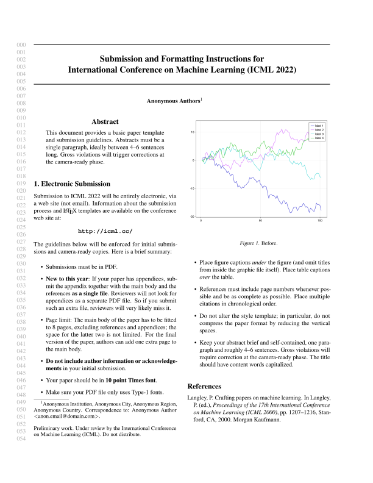
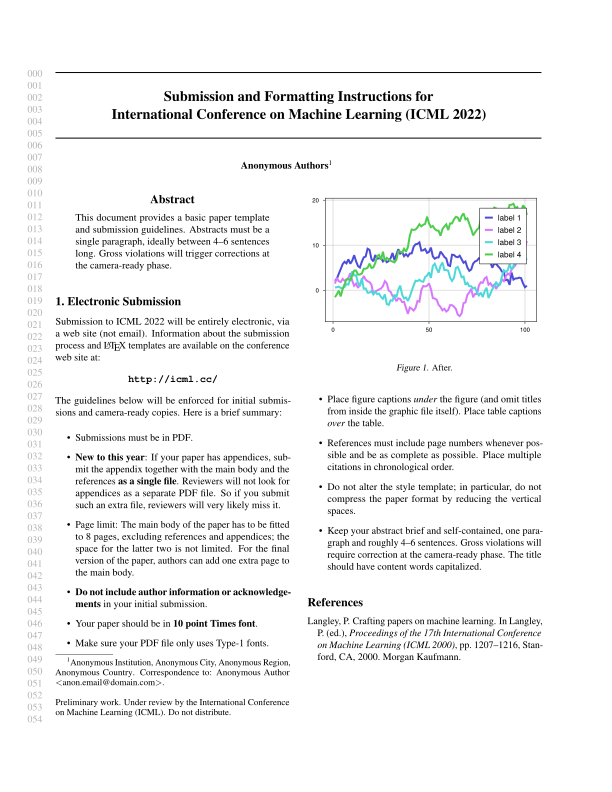
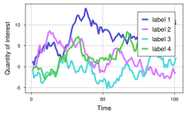
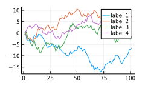

# TuePlots.jl

[](https://nathanaelbosch.github.io/TuePlots.jl/stable/)
[](https://nathanaelbosch.github.io/TuePlots.jl/dev/)
[](https://github.com/nathanaelbosch/TuePlots.jl/actions/workflows/CI.yml?query=branch%3Amain)
[](https://codecov.io/gh/nathanaelbosch/TuePlots.jl)


A Julia version of [tueplots](https://github.com/pnkraemer/tueplots/) for creating plots for scientific publications with minimal overhead.

---

Work in progress!
This is just a quick first draft.
Many of the nice features of [tueplots](https://github.com/pnkraemer/tueplots/) are still missing.

---

## CairoMakie.jl defaults vs TuePlots.jl
 

On the left, the font sizes are off since the original figure has been rescaled down to fit the paper column.
With TuePlots.jl you don't need `\includegraphics[width=\linewidth]` anymore since the figure pdf itself has the correct size.

You only need to add three lines to get correctly sized plots:
```julia
using CairoMakie, TuePlots

data = cumsum(randn(4, 101), dims = 2)

# These are the additional lines to set fonts, figsize, and make the plot a bit more sleek
update_theme!(TuePlots.MakieFontsizeTheme(:icml2022))
update_theme!(TuePlots.MakieThinTheme())
update_theme!(resolution=TuePlots.FIGSIZES[:icml2022_half])

# Then, plot as usual
fig = Figure()
ax = Axis(fig[1, 1], xlabel="Time", ylabel="Quantity of interest")
sp = series!(ax, data, labels = ["label $i" for i in 1:4])
axislegend(ax)
save("plot.pdf", fig, pt_per_unit=1) # pt_per_unit is needed to ensure the correct sizes
```
<p align="center">

</p>

Voilà! Now you can focus on the important things, like choosing the best color scheme for your plot.


## Using TuePlots.jl with Plots.jl
You can also use TuePlots.jl with Plots.jl!
Just set the figure size and font size via `Plots.theme` as follows:
```julia
using Plots, TuePlots

data = cumsum(randn(4, 101), dims = 2)

theme(:default;
      size = TuePlots.FIGSIZES[:icml2022_half],
      TuePlots.plotsjl_fontsize_theme_kwargs(:icml2022)...)
plot(data', label = permutedims(["label $i" for i in 1:4]))
savefig("plot.pdf")
```
<p align="center">

</p>
