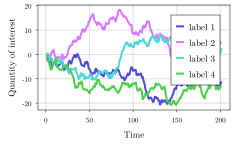
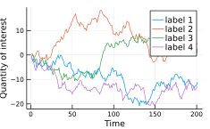

# TuePlots.jl

[](https://nathanaelbosch.github.io/TuePlots.jl/stable/)
[](https://nathanaelbosch.github.io/TuePlots.jl/dev/)
[](https://github.com/nathanaelbosch/TuePlots.jl/actions/workflows/CI.yml?query=branch%3Amain)
[](https://codecov.io/gh/nathanaelbosch/TuePlots.jl)

A Julia version of [tueplots](https://github.com/pnkraemer/tueplots/) for creating plots for scientific publications with minimal overhead.

* * *

Work in progress!
This is just a quick first draft.
Many of the nice features of [tueplots](https://github.com/pnkraemer/tueplots/) are still missing.

* * *

## Installation

Install TuePlots.jl directly from github:

```
julia> ]
(v1.7) pkg> add https://github.com/nathanaelbosch/TuePlots.jl
```

## CairoMakie.jl defaults vs TuePlots.jl

 

On the left, the font sizes are off since the original figure has been rescaled down to fit the paper column.
With TuePlots.jl you don't need `\includegraphics[width=\linewidth]` anymore since the figure pdf itself has the correct size.

You only need to add three lines to get correctly sized plots:

```julia
using CairoMakie, TuePlots, Random

data = cumsum(randn(Xoshiro(2), 4, 201), dims = 2)

# These are the additional lines to set fonts, figsize, and make the plot a bit more sleek
T = Theme(
    TuePlots.SETTINGS[:AISTATS2022];
    font = true,
    fontsize = true,
    figsize = :half,
    thinned = true,
)

# Then, plot as usual
with_theme(T) do
    fig = Figure()
    ax = Axis(fig[1, 1], xlabel = "Time", ylabel = "Quantity of interest")
    sp = series!(ax, data, labels = ["label $i" for i in 1:4])
    axislegend(ax)
    save("makie.pdf", fig, pt_per_unit = 1) # pt_per_unit is needed to ensure the correct sizes
end
```

<p align="center">

</p>

Voilà! Now you can focus on the important things, like choosing the best color scheme for your plot.

## Using TuePlots.jl with Plots.jl

**WARNING:** This is still experimental and some features do not yet work correctly! For the best experience, use TuePlots with (Cairo)Makie.

To use TuePlots.jl with Plots.jl, you can let TuePlots generate keyword arguments for `Plots.theme` as follows:

```julia
using Plots, TuePlots, Random

data = cumsum(randn(Xoshiro(2), 4, 201), dims = 2)

theme(:default;
    TuePlots.get_plotsjl_theme_kwargs(
        TuePlots.SETTINGS[:ICML2022];
        fontsize = true,
        figsize = :half,
    )...)

plot(data',
    label = permutedims(["label $i" for i in 1:4]),
    xlabel = "Time",
    ylabel = "Quantity of interest",
);
savefig("plotsjl.pdf")
```

<p align="center">

</p>
